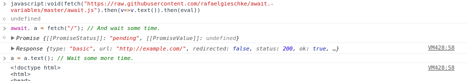
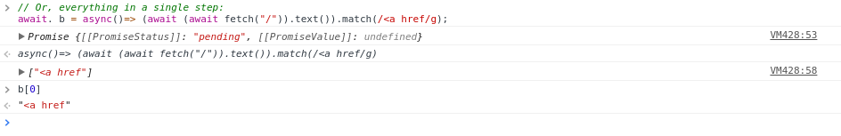

# await. variables 

- <https://github.com/rafaelgieschke/await.-variables>

> await.-variables make interactively debugging `Promise`s a breeze.

JavaScript's `Promise`s (in ECMAScript 2015) and `async function`s (in ECMAScript 2017) are great but can be hard to debug interactively in Consoles.

This library helps by letting you declare `await.` variables. They are like `var` variables but automatically resolve `Promise`s, print the fulfillment value (using `console.log`) and assign the fulfillment value to themselves. Additionally, they automatically execute parameter-less `async` (arrow) functions:




```javascript
// Load library:
fetch("https://rafaelgieschke.github.io/await.-variables/await.js").then(v=>v.text()).then(eval);
// Instead of:
var promise = fetch("/");
// Execute this in Console:
await. a = fetch("/");
// (Be sure to include the dot after await!)
// Wait some time until result of `Promise` gets printed in Console.
a = a.text();
// Wait some more time.
a.match(/<a href/g);
// Or, everything in a single step:
await. b = async()=> (await (await fetch("/")).text()).match(/<a href/g);
```

If you forgot to declare an `await.` variable, you can convert a normal global `var` variable into an `await.` retroactively:

```javascript
c = fetch("/");
await. c;
```

If you want an `await.` variable to lose its special powers, you can "undeclare" it via the `delete` operator:

```javascript
delete c;
c = fetch("/");
// No longer tries to automatically resolve c.
```

If the `Promise` gets rejected, its rejection value will be printed using `console.error` and also get assigned to the variable:

```javascript
await. d = fetch("invalid://");
```

## Installation

### In the Browser

Execute:

```javascript
fetch("https://rafaelgieschke.github.io/await.-variables/await.js").then(v=>v.text()).then(eval);
```

in the console.

Depending on the [CSP](https://w3c.github.io/webappsec-csp/) of the target web page (if any), you might have more luck using:

```javascript
document.documentElement.appendChild(document.createElement("script")).src="https://rafaelgieschke.github.io/await.-variables/await.js";
```

To automate the process, you can bookmark this
<a href="javascript:fetch('https://rafaelgieschke.github.io/await.-variables/await.js').then(v=>v.text()).then(eval);document.documentElement.appendChild(document.createElement('script')).src='https://rafaelgieschke.github.io/await.-variables/await.js';void0">await.-variables bookmarklet</a> (if you cannot see a link, you might have to look at this documentation at [github.io](https://rafaelgieschke.github.io/await.-variables/)) and click it on the target page. It will try both ways of execution.

Lastly, you can also import await.-variables as a module:

```javascript
import "https://rafaelgieschke.github.io/await.-variables/await.js";
```

### For Node.js

```sh
npm install await.-variables
```

```javascript
require("await.-variables");
```

## Goals of await.-variables

- Allow to debug `Promise`s in the Console (like [Chrome's DevTools Console](https://developers.google.com/web/tools/chrome-devtools/console/), [Firefox's Web Console](https://developer.mozilla.org/en-US/docs/Tools/Web_Console))
- Integrate into any JavaScript context (Console, [JavaScript Shell](http://www.squarefree.com/shell/), [Remote Debugging](https://developers.google.com/web/tools/chrome-devtools/remote-debugging/), [Firebug Lite](https://getfirebug.com/firebuglite), [weinre](https://people.apache.org/~pmuellr/weinre/docs/latest/), NodeJS, ...)
- Seamlessly integrate into normal Console usage
- Be as lightweight as possible
- Provide as little overhead as possible in typing
- Be structurally correct JavaScript, allow usage of normal auto-completion of variables (eg., do not embed executed code into a string like ``async `result = await fetch("/")` ``)

- But: Be strictly focused on debugging

## Shouldn't they be called `async.` variables?

Maybe. Maybe not.

## License

[MIT](https://opensource.org/licenses/MIT)
